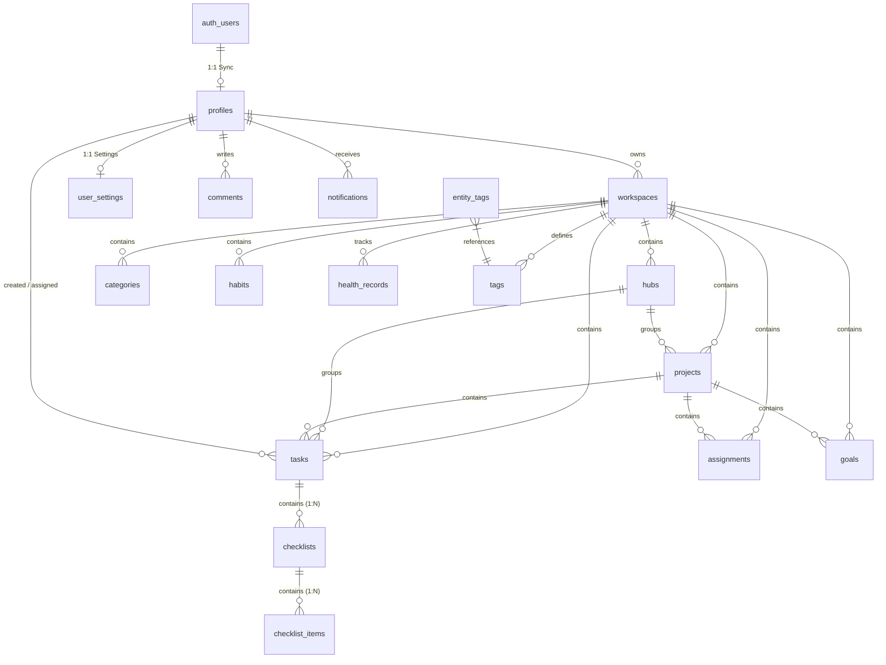

# LifeOS Backend Architecture & Database Specification (v1.1 Enhancement)

This deliverable contains the complete, production-ready PostgreSQL database architecture, Supabase integration layer, and **v1.1 Checklist System enhancements** for **LifeOS**.

---

## 1. Entity Relationship (ER) Diagram (v1.1)



---

## 2. v1.1 Enhancement: Checklist System Tables

| Table | Primary Key | Foreign Key | Key Attributes |
| :--- | :--- | :--- | :--- |
| **checklists** | `id` (UUID) | `task_id` -> `tasks(id) ON DELETE CASCADE` | `title`, `sort_order`, `created_at`, `updated_at` |
| **checklist_items** | `id` (UUID) | `checklist_id` -> `checklists(id) ON DELETE CASCADE` | `title`, `is_completed`, `sort_order`, `completed_at`, `created_at`, `updated_at` |

---

## 3. Data Integrity & CHECK Constraints (v1.1)

The following CHECK constraints ensure non-negative numeric data:

- **Tasks**: `CHECK (estimated_hours >= 0)`, `CHECK (actual_hours >= 0)`
- **Goals**: `CHECK (target_value >= 0)`, `CHECK (current_value >= 0)`
- **Habits**: `CHECK (target_per_day >= 0)`, `CHECK (target_per_week >= 0)`, `CHECK (current_streak >= 0)`, `CHECK (best_streak >= 0)`
- **Health Records**: `CHECK (value >= 0)`

---

## 4. Performance Indexes & RLS Policies (v1.1)

### Indexes:
- `idx_checklists_task_id` ON `checklists(task_id)`
- `idx_checklist_items_checklist_id` ON `checklist_items(checklist_id)`
- `idx_checklist_items_completed` ON `checklist_items(is_completed)`

### RLS Policies:
Row Level Security is enabled on `checklists` and `checklist_items` to ensure workspace boundary security:

```sql
CREATE POLICY "Workspace users access checklists" ON public.checklists
    FOR ALL USING (task_id IN (
        SELECT id FROM public.tasks WHERE workspace_id IN (
            SELECT id FROM public.workspaces WHERE owner_id = current_profile_id()
        )
    ));

CREATE POLICY "Workspace users access checklist_items" ON public.checklist_items
    FOR ALL USING (checklist_id IN (
        SELECT id FROM public.checklists WHERE task_id IN (
            SELECT id FROM public.tasks WHERE workspace_id IN (
                SELECT id FROM public.workspaces WHERE owner_id = current_profile_id()
            )
        )
    ));
```

---

## 5. Repository Layer Integration (v1.1 CRUD Methods)

Extended `SupabaseRepository` ([supabaseRepository.ts](file:///d:/todo_list/repositories/supabaseRepository.ts)) with:

- `getChecklists(taskId: string)`
- `createChecklist(taskId: string, title: string, sortOrder?: number)`
- `updateChecklist(checklistId: string, title: string)`
- `deleteChecklist(checklistId: string)`
- `createChecklistItem(checklistId: string, title: string, sortOrder?: number)`
- `toggleChecklistItem(itemId: string, isCompleted: boolean)`
- `deleteChecklistItem(itemId: string)`
